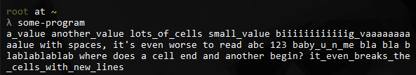

# Gridt

Display contents as a grid in the terminal. Works with matrixes (slices of slices), whose number of cells, columns and rows are well-defined, and with lists (slices) that still need to calculate the count of the columns and rows and the size of each item.

Inspired by [ogham/rust-term-grid][1].

### Example

**What we do not want:**

**What we want:**

### License

This project code is in the public domain. See the [LICENSE file][2].

[1]: https://github.com/ogham/rust-term-grid/
[2]: https://github.com/Nhanderu/gridt/blob/master/LICENSE
